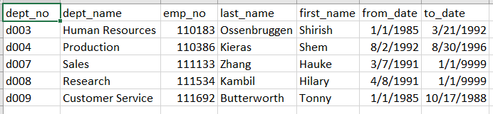
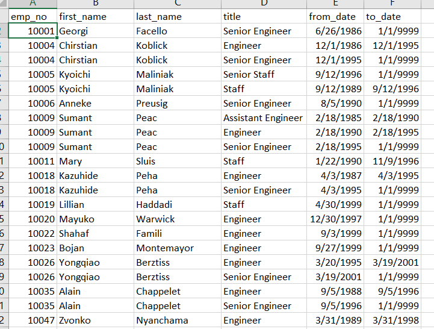
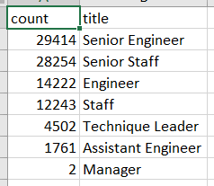

# PH Balance: Retirement Analysis for Pewlett Hackard

## An Overview
This analysis is to review and account for the labor force of Pewlett Hackard, most specifically the number of employees that will be retiring soon and the opennings they will leave behind. With a handful of CSV files with information about it's employees we were tasked with assisting Human Resources in building their database and figuring how many will be retiring in the next 3 years and what positions will be left behind. Once we began to organize the data, we noticed possible holes in the data, for example in looking how many managers there were, only 5 appeared. 

Never the less we continued with the information we had and built a picture of the company's workforce via this database. Then specifically started looking at employees of retirement age, and their positions in the company since these will be the positions that will need to be filled. This report focuses on these findings and what they forecast for Pewlett Hackard.

## The Silver Tsunami
A similar problem being faced by companies across the country is baby boomers retiring at the same time, most with a wealth of knowledge about the companies they work for. The future retirees at Pewlett Hackard are no exception. As we go through the data we sort out up coming retirees  and future retirees. Most have grown with PH and it's this group of future retirees that PH will target to head our mentorship program and teach employees that want to grow in these key positions being left vacant by retirees. 

As we worked at sorting out the information that was provided we notices employees names came up repeatedly, noticing that they had help a few positions within the company:

As we merged information together and separated previous employees and employees not eligible for retirement we ended up with a more concise list of the upcoming positions and how many openings they would have: 

Managerial positions continue to be undercounted with only 2 possible vacancies. Many vacancies are coming in engineering and of course senior adminnistrative staff; all these are great oppotunities for growth with our younger personnel. 

As mentioned before it would be great to produce our workforce to fill these vacancies from within, seeing this opportuniy PH would like to tap into the employees that are also a few years from retirement to mentor the next engineers, techs, and staff. Our team has also compiled a list of eligible mentors to help with this project. Here is a snapshot of them:

As noticed in their years of service to the company, this list of employees have been with PH for a long time. These employees would best pass on the core values of PH and best practices as they've developed great knowledge of the company. 

## Surfing the wave
As we see some of our most senior employees retire it's great to feel that our products and services have survived in this growing industry. This longevity will see other employees to their retirement goals and foster new employment to graduates and other job seekers. During this report we've identified those employees that will be retiring soon and those that still have a few more years to go and can possibly pass on knowledge via a mentorship program. 